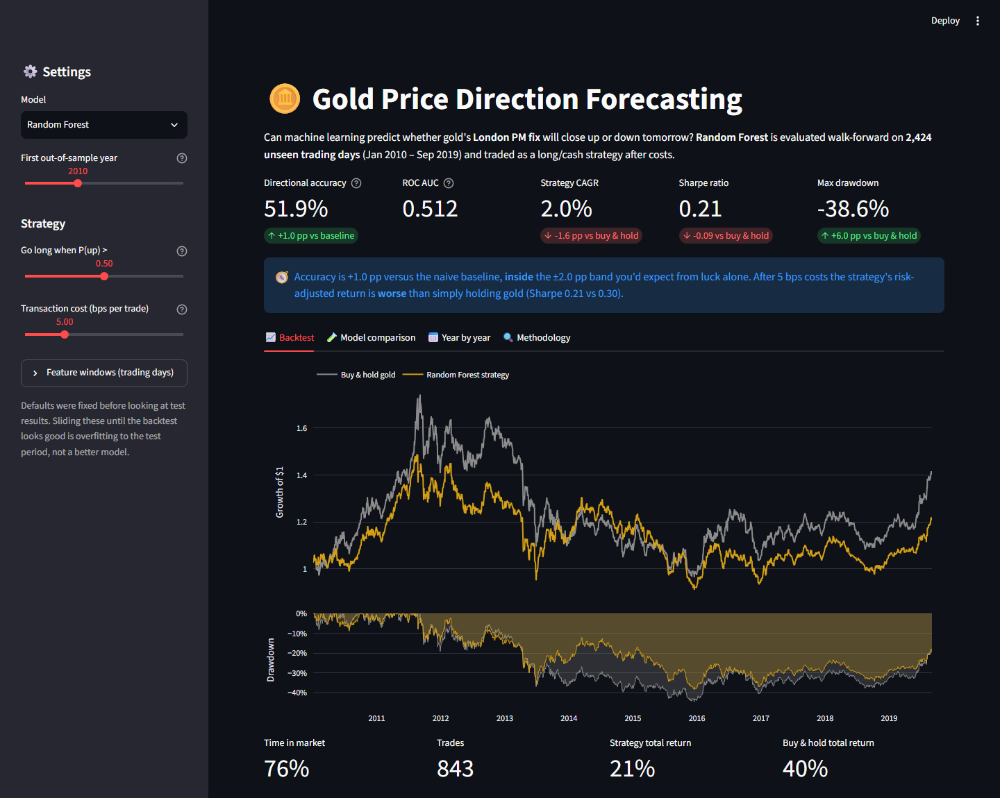
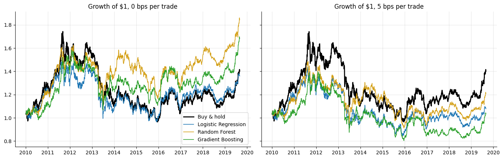
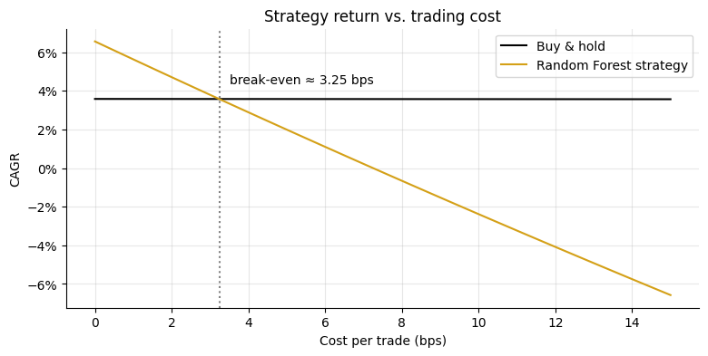
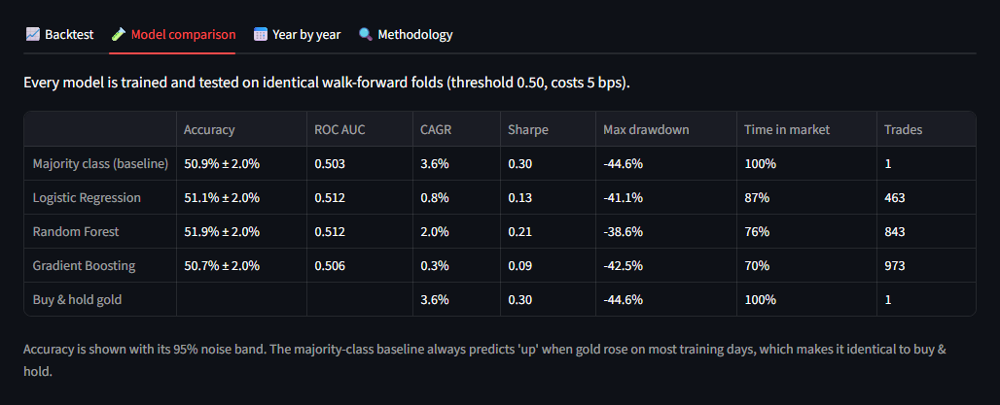
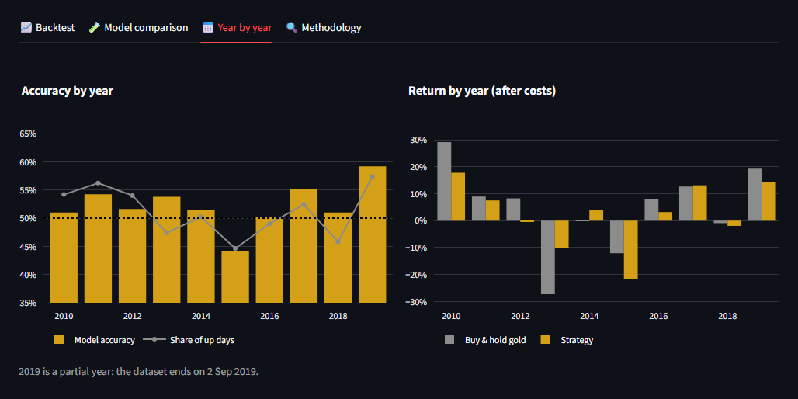

# 🪙 Algo-Trading Gold Price Predictor

[](https://algo-trading-gold-price-predictor.streamlit.app/)
[](https://github.com/lucifer-135/Algo-Trading-Gold-Price-Predictor/actions/workflows/tests.yml)


**Can machine learning predict whether gold will rise tomorrow, and would trading on that prediction beat simply holding gold?**

A leakage-free, walk-forward-validated and cost-aware study on 18 years of daily LBMA gold prices, with an interactive Streamlit dashboard. **[Try the live app →](https://algo-trading-gold-price-predictor.streamlit.app/)**



## Key findings

Out-of-sample results, walk-forward tested on **2,424 trading days (Jan 2010 – Sep 2019)**. Every setting was fixed before the first test run.

| Model | Accuracy (95% CI) | ROC AUC | CAGR / Sharpe, no costs | CAGR / Sharpe, 5 bps per trade | Trades |
|---|---|---|---|---|---|
| Buy & hold gold | – | – | 3.6% / 0.30 | 3.6% / 0.30 | 1 |
| Majority class (baseline) | 50.9% ± 2.0 | 0.503 | 3.6% / 0.30 | 3.6% / 0.30 | 1 |
| Logistic Regression | 51.1% ± 2.0 | 0.512 | 3.2% / 0.29 | 0.8% / 0.13 | 463 |
| **Random Forest** | **51.9% ± 2.0** | **0.512** | **6.6% / 0.53** | 2.0% / 0.21 | 843 |
| Gradient Boosting | 50.7% ± 2.0 | 0.506 | 5.6% / 0.47 | 0.3% / 0.09 | 973 |

1. **No model is statistically better than the naive baseline.** The best accuracy, 51.9%, lies within the ±2.0 pp noise band around the "always predict up" baseline's 50.9%.
2. **The edge doesn't survive trading costs.** Before costs, the Random Forest strategy beats buy & hold (Sharpe 0.53 vs 0.30, max drawdown −31% vs −45%). It trades about 90 times a year, though, and its advantage is gone at **about 3 bps per trade**.
3. **A single test year can't be trusted.** The Random Forest's accuracy ranges from 44% to 59% across individual test years, so evaluating on one year makes luck look like skill.

The conclusion is that daily gold direction is close to unpredictable from its own price history. That is consistent with an efficient market. The value of this project is an evaluation framework that reaches that conclusion honestly instead of overfitting a backtest.




## Dashboard

The [Streamlit app](https://algo-trading-gold-price-predictor.streamlit.app/) lets you switch models, change the test start year, entry threshold, trading costs and feature windows. Every view is compared against the naive baseline and buy & hold.

| Model comparison | Year by year |
|---|---|
|  |  |

## How the evaluation stays honest

| Pitfall | Guard in this project |
|---|---|
| **Look-ahead leakage** | Features for day *t* use data up to *t-1* only. The same-day AM fix is excluded because it is published after the decision point. A unit test perturbs future prices and asserts that no feature changes. |
| **Lucky test split** | Expanding-window **walk-forward** validation: each year 2010–2019 is predicted by a model trained only on earlier years. |
| **Tuning on the test set** | Feature windows, model hyperparameters, threshold and cost were fixed before the first evaluation. The dashboard warns that tuning sliders until the backtest looks good is overfitting. |
| **Accuracy without context** | Every model is compared against a majority-class baseline and buy & hold, and accuracy is reported with a 95% confidence interval. |
| **Frictionless backtest** | Each position change pays a configurable transaction cost; the break-even cost is reported. |
| **Silent data issues** | Days without a PM fix (last trading days before Christmas and New Year) are dropped *before* computing returns, so no return is lost and results don't depend on the pandas version. |

## Features

All features are computed from information available at the previous day's PM fix:

- Lagged daily returns (1, 2, 3 and 5 days)
- Price relative to its 5-day and 20-day moving averages (trend)
- 10-day rolling volatility
- 14-day RSI
- Previous day's EUR/USD move, derived from gold's USD and EUR prices (a weaker dollar tends to lift gold)

## Project structure

```
├── app.py                        # Streamlit dashboard
├── gold_price_prediction.ipynb   # Narrative analysis: EDA → features → walk-forward → backtest
├── goldpred/                     # Reusable, tested pipeline
│   ├── data.py                   #   load and clean LBMA prices
│   ├── features.py               #   leakage-free feature engineering
│   ├── models.py                 #   baseline + 3 classifiers
│   ├── evaluate.py               #   walk-forward splits and metrics
│   ├── backtest.py               #   cost-aware long/cash backtest, Sharpe, drawdown
│   ├── report.py                 #   model comparison table
│   └── __main__.py               #   CLI: python -m goldpred
├── tests/                        # pytest: no look-ahead, split integrity, backtest math, app smoke test
├── data/gold_price.csv           # LBMA daily gold fixes, 2001-01-02 to 2019-09-02
└── .github/workflows/tests.yml   # CI
```

## Quick start

```bash
git clone https://github.com/lucifer-135/Algo-Trading-Gold-Price-Predictor.git
cd Algo-Trading-Gold-Price-Predictor
pip install -r requirements-dev.txt

streamlit run app.py      # interactive dashboard
python -m goldpred        # print the model comparison table (try --cost-bps 0)
pytest                    # run the test suite
```

## Tech stack

Python · pandas · NumPy · scikit-learn (Logistic Regression, Random Forest, HistGradientBoosting) · Streamlit · Plotly · Matplotlib · pytest · GitHub Actions

## Limitations and next steps

- **Features:** only price-derived and FX features are used. Macro drivers such as real interest rates, the DXY dollar index and VIX are natural additions.
- **Horizon:** daily direction is the hardest horizon. Weekly or monthly trend signals have more support in the literature.
- **Sizing:** positions are all-or-nothing. Sizing by predicted probability or by volatility could reduce turnover and costs.
- **Statistical testing:** the Sharpe-ratio differences are not formally tested (e.g. with the Ledoit–Wolf test).
- **Data:** the dataset ends in September 2019 and does not include the 2020–2025 gold rally.

## Data

Daily gold price fixes from the [London Bullion Market Association (LBMA)](https://www.lbma.org.uk/prices-and-data/precious-metal-prices): AM and PM auctions in USD, GBP and EUR, January 2001 to September 2019 (4,718 rows).

## License

[MIT](LICENSE) © Shivansh Gautam
